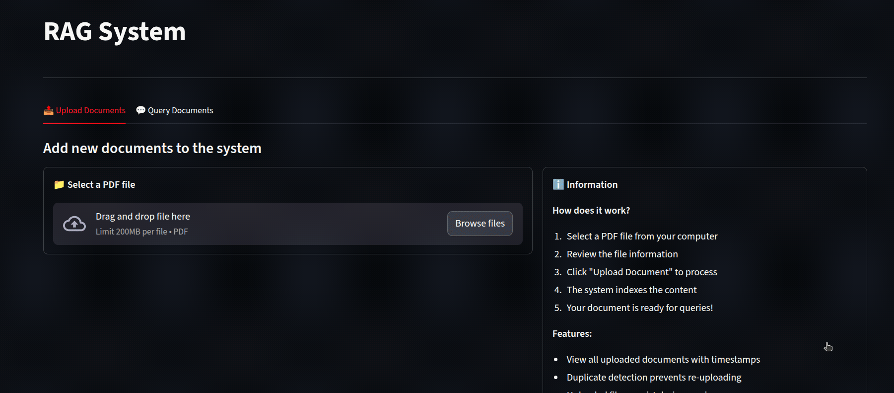

# Embedded RAG pdf

RAG system for PDF documents using Qdrant vector DB and Inngest orchestration.

## Demo
<p align="center">


</p>

## Features

- PDF document ingestion and chunking
- Interactive Streamlit UI for document management
- Async function orchestration with Inngest

## Tech Stack

- **Vector Database**: [Qdrant](https://qdrant.tech/) - High-performance vector similarity search
- **Orchestration**: [Inngest](https://www.inngest.com/) - Reliable function orchestration
- **LLM**: Groq
- **Embeddings**: Sentence Transformers
- **API**: FastAPI
- **UI**: Streamlit

## Prerequisites

- Python 3.13+
- Docker (for Qdrant)
- Groq API key ([Get one here](https://console.groq.com/))

## Installation

1. Clone the repository:
```bash
git clone https://github.com/yourusername/embedded-rag-pdf.git
cd embedded-rag-pdf
```

2. Install dependencies with uv:
```bash
uv sync
```

## Configuration

1. Copy the example environment file:
```bash
cat .env.example > .env
```

2. Edit `.env` and add your Groq API key and your groq model:
```env
GROQ_API_KEY=your_groq_api_key_here
GROQ_MODEL=your_groq_model (default = llama-3.1-8b-instant)
```

## Usage

### 1. Start Qdrant (Vector Database)

Run Qdrant in a Docker container:
```bash
docker run -d --name qdrantRagDB -p 6333:6333 -v "$(pwd)/qdrant_storage:/qdrant/storage" qdrant/qdrant
```

### 2. Start Inngest Dev Server

In a separate terminal, start the Inngest development server:
```bash
npx inngest-cli@latest dev
```

### 3. Start the FastAPI Application

Run the main application with uvicorn:
```bash
uv run uvicorn main:app --reload
```

The API will be available at `http://localhost:8000`

### 4. Start the Streamlit UI (Optional)

In another terminal, launch the Streamlit interface:
```bash
uv run streamlit run interface.py
```

Access the UI at `http://localhost:8501`

